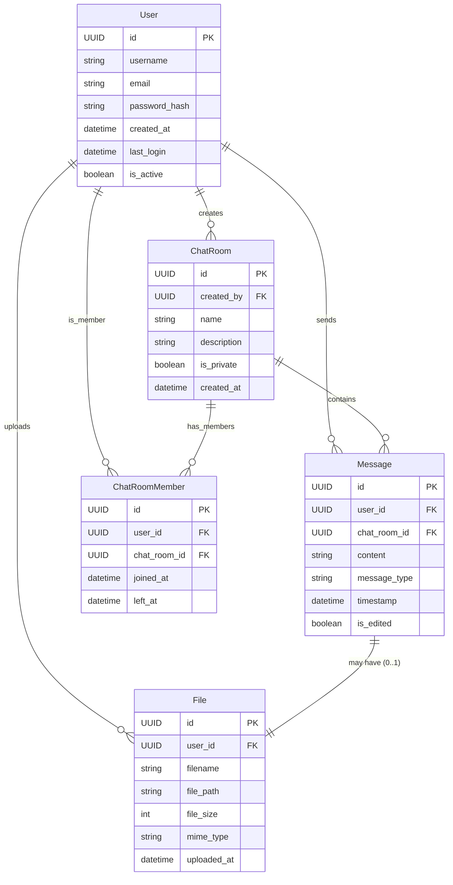
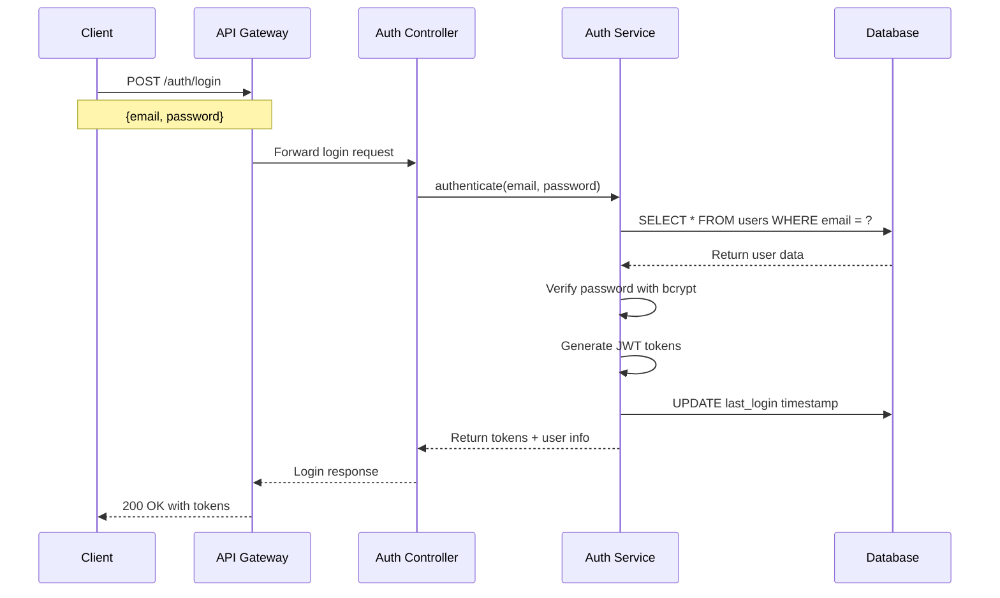
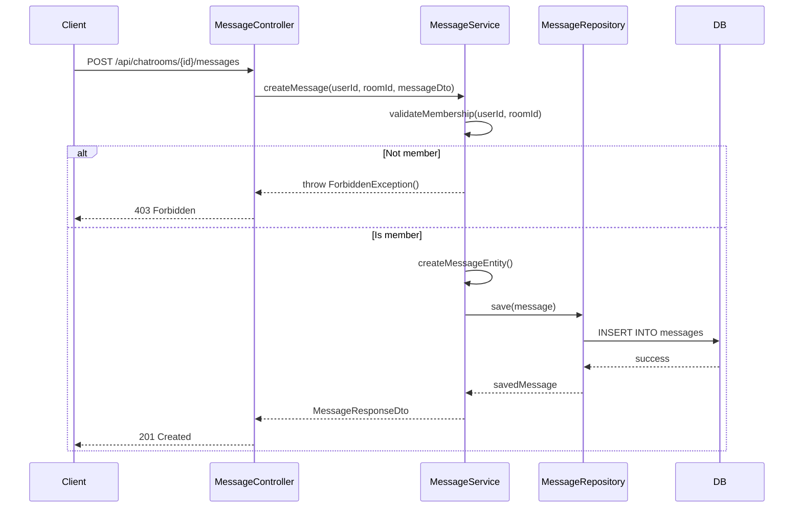
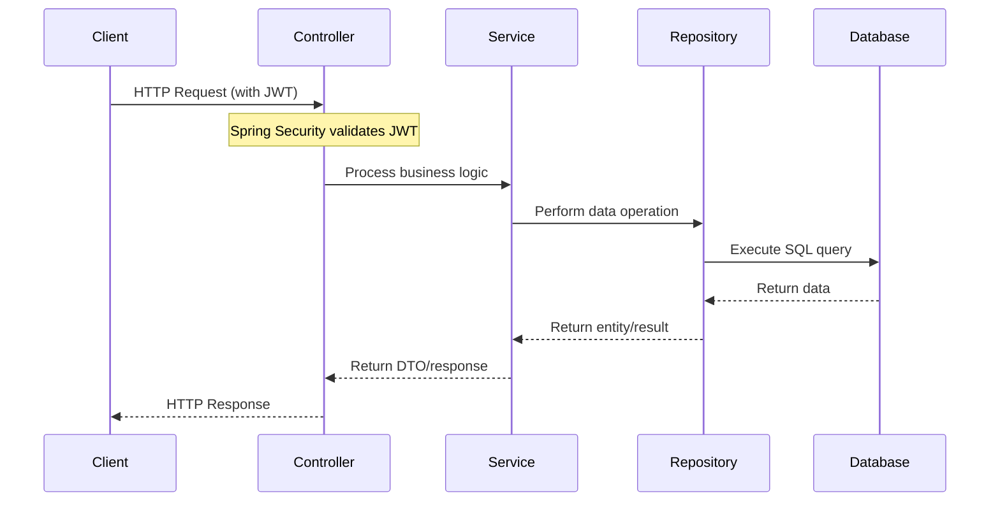
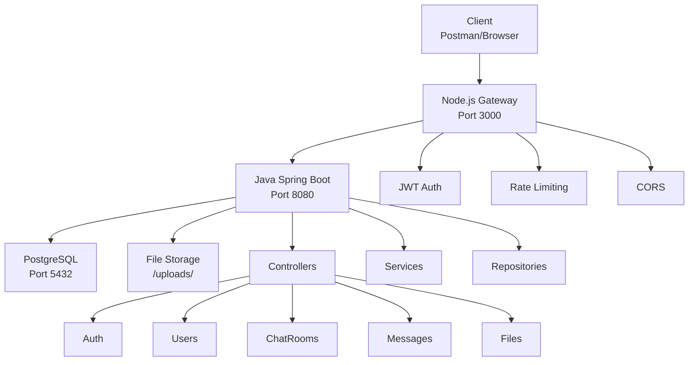
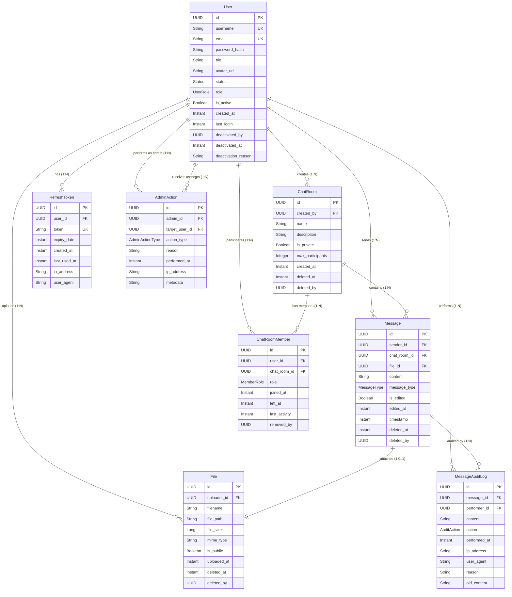
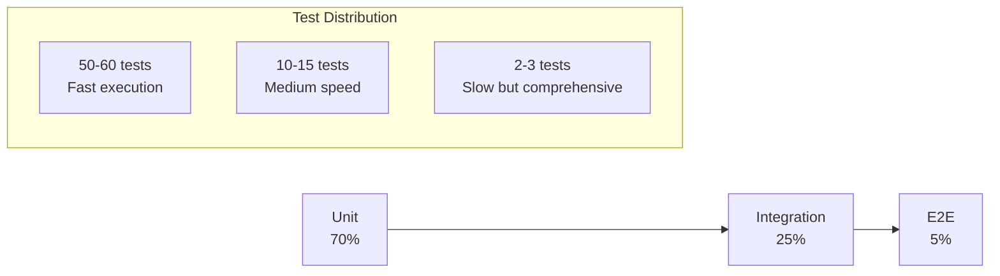

# System Design & Architecture Flows

This document details the core data flows, class structures, and technical architecture for the SecureChat application.

## 7.2 Klassendiagram (Class Diagram)

## 8. Sequentiediagrammen (Sequence Diagrams)

### 8.1 User Login & JWT Token Issuance

### 8.2 Bericht Versturen (Message Sending)

### 8.3 Polling Flow

## 9. Technische Architectuur

### 9.1 Architectuuroverzicht

## 13.3 Entity Relationship Diagram (ERD)

## Testing Strategy

## 14. Implementation Details & Code Maps

### 14.1 Real-time Messaging (Server-Sent Events)
**Implementatie**:
*   **Controller**: `MessageController.java` (`streamMessages` endpoint, ~line 189) handles the SSE connection.
*   **Publishing**: `MessageController.java` (`sendMessage` method, ~line 102) publishes "new-message" events via `MessageStreamService`.
*   **Rationale**: SSE chosen over WebSockets for simpler HTTP-based protocol and automatic browser reconnection, sufficient for server-to-client updates.

### 14.2 Database: ChatRoomMember Join-Table
**Implementatie**:
*   **Entity**: `ChatRoomMember.java` explicitly maps the N:M relationship between `User` and `ChatRoom`.
*   **Structure**: Includes metadata fields like `joined_at`, `role` (ADMIN/MEMBER), and `last_read_at`.
*   **Benefits**: Enables efficient membership queries and role-based access control compared to simple ID arrays.

### 14.3 Bestandsdownloads (Streaming)
**Implementatie**:
*   **Controller**: `FileController.java` returns `ResponseEntity<Resource>` to stream data.
*   **Storage**: `LocalFileStorageService.java` uses `UrlResource` (line 71) to reference files on disk without loading them entirely into memory.
*   **Benefit**: Prevents `OutOfMemoryError` when handling large file downloads (>500MB).

### 14.4 Soft Delete Audit Trail
**Implementatie**:
*   **Entity**: `Message.java` uses an `isDeleted` boolean flag and `deletedAt` timestamp.
*   **Service**: `MessageService.deleteMessage` (lines 229-236) performs a logical delete update rather than a physical `DELETE` SQL command.
*   **Benefit**: Preserves history for audit purposes and data recovery.

### 14.5 Architecture & Code References

| Categorie | Onderwerp | Keuze | Code Reference (Verified) | Notes |
| :--- | :--- | :--- | :--- | :--- |
| **Architectuur** | JWT-verificatie | Node.js Gateway | `nodejs-gateway/server.js` | Lines 40-70 (Proxy logic) |
| **Code** | DTO-conversie | Handmatige mappers | `MessageController.java` | Uses `MessageDtoMapper` |
| **Database** | UUID Keys | `java.util.UUID` | `User.java`, `RefreshToken.java` | `@GeneratedValue(strategy=UUID)` |
| **Opslag** | Bestanden | Lokaal (`/uploads/`) | `LocalFileStorageService.java` | Generates UUID filenames |
| **Verbetering** | Real-time | SSE (SseEmitter) | `MessageController.java` | `streamMessages` & `publish` |
| **Verbetering** | Membership | Join-tabel | `ChatRoomMember.java` | Full Entity Implementation |
| **Verbetering** | Downloads | Streaming Resource | `FileController.java` | Returns `ResponseEntity<Resource>` |
| **Verbetering** | Compliance | Soft Delete | `MessageService.java` | `softDelete` method implemented |

